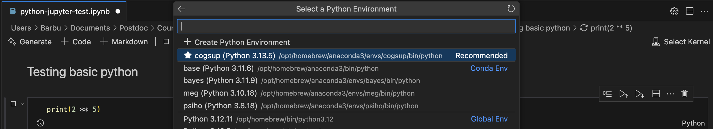

# Testing the Software Installation

## Check Git

### Our course repository
Download the course materials using Git by entering the following command line in a Terminal:: 

```bash
git clone https://github.com/barburevencu/PPE
```

You should see a message ``Cloning into 'PPE'...`` and, if everything goes well, all the currently available
course materials (python scripts, data files, ...) should be downloaded in a new subdirectory called ``PPE``, within the current working directory. You can cd into it and list its content:

```bash
cd PPE # Changes the current working directory to the PPE folder
pwd # Displays the address of the current working directory
ls # Lists the contents of the current working directory
```

Your Terminal window should more or less look like this:


**Warning**
   If a folder named ``PPE`` already exists in the current working
   directory, git will stop and will not download the content of the remote PPE
   repository. In that case, you must delete or move the existing ``PPE`` folder
   before running the ``git clone`` command above.

   When you open a Terminal, the current working directory is your Home/User
   directory, until you start navigating the file system with the `cd`
   (change directory) command.

---

### Your course repository
In the Terminal, use ```cd``` to navigate to a folder on your computer that you will use for the class. (Make sure it's a different folder from the PPE folder corresponding to the course repository.) Then, enter:

```bash
git clone https://github.com/YOUR-GITHUB-USERNAME/cogsup-prog
```

(Your GitHub username can be found on any GitHub page in the upper-right corner—click on the icon.)

In your file manager (e.g., Finder on Mac, File Explorer on Windows), go to the ```PPE``` folder and copy the subfolder called ```Week-0```. Go to the ```cogsup-prog``` folder where you cloned your own repository and paste the ```Week-0``` subfolder.

Back in the terminal, type in:

```bash
git add .
git commit -m "Lecture 0 Slides" # This is a summary of the changes you are making
git push origin
```

You will be asked for your username (set up when you've signed up) and for a password. Do not enter your GitHub password, but the long token generated beforehand. This is a one-time process—afterward, the above ```add```, ```commit```, and ```push``` will work automatically.

Go to your GitHub account in your browser and check that your repository account now contains the ```Week-0``` subfolder.

## Check Python

Assuming you are in the PPE directory, navigate to the Test folder, then run the following python script and play the game in the Terminal.

```bash
cd Installation/Test
python python-basic-test.py
```

---

### Check basic graphics
Make sure (for instance, by using `pwd`) that you are still in the ```PPE/Installation/Test``` directory. Then, type:

```bash
python python-graphics-test.py
```


To check the code, launch the Visual Code editor and open the python file ``PPE/Installation/Test/python-graphics-test.py``. 

---

### Check pygame
[Pygame](https://www.pygame.org/news) is a Python library to create simple audio visual games. 

While still in the ```PPE/Installation/Test``` directory, launch the python script `pygame-test.py`.  


---

### Check Expyriment
[Expyriment](https://expyriment.org) is a Python library for designing and conducting behavioural and neuroimaging experiments.

While still in the ```PPE/Installation/Test``` directory, launch the python script `expyriment-test.py`.

   ```bash
   python expyriment-test.py
   ```
   
This should run a quick experiment where you must check whether a number is odd or even.

---

## Check R and RStudio

Launch RStudio, and in the Console (left window), type::
```r
example(density)
```

This should display a series of graphics (Press `Enter` to advance). Close RStudio.

---

## Check Jupyter
### Python
Navigate to the `PPE/Installation/Test/Installation` folder, then open the `python-jupyter-test.ipynb` file. If it doesn't open in VS Code by default, right-click on the file and open it with VS Code.

Drag your mouse to the left of the first code-containing box and click on the ⏵ button. VS Code will prompt you to select a kernel. Click on `Python environments...`, then select the python version installed during the software installation process. This will fix python as the kernel (the interpreter) of the current session. The VS Code window should look something like this:



Once you see 32 printed out, scroll down to the other code-containing boxes and run them in the same way.

### R
Open the `r-jupyter-test.ipynb` file in VS Code. When prompted to choose a kernel, click on `Select another kernel...` → `Jupyter kernel...` → `R`. Once you've selected the kernel, run all cells, just as you did for the python script.

---

## Keep the course material on your directory up to date
The course materials will be updated regularly. To make sure you have the latest version, synchronize your local copy with [the course github repository](https://github.com/barburevencu/PPE), with the following commands:

```bash
cd ~/PPE
git pull
```

**Notes**:
- If the PPE directory is not in your home directory (``-``), you will need to use the appropriate path in the first ```cd``` command.
- Do not manually modify or create new files in the ``PPE`` folder.
  If you do so, git might prevent an automatic upgrade
  and ask you to resolve conflicts. If you get such a message, the
  simplest course of action, for beginners, is to delete the PPE folder (or
  move it if you wnat to keep a copy of your modifications) and reissue the
  ``git clone`` command above to reload the full folder.